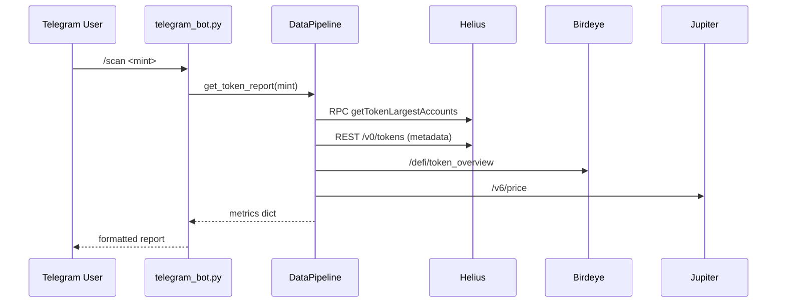

# Blaze Analyst – Solana Token-Analysis Telegram Bot

---

Blaze Analyst is a Python-based Telegram bot that audits any Solana SPL-token in real-time.  It fetches on-chain data (holders, supply), market data (price, liquidity) and risk signals (taxes, LP lock) then formats a Markdown-V2 report for end-users.

<details>
<summary>Table of Contents</summary>

1. Quick Start  
2. Runtime Architecture  
3. External Integrations  
4. Caching Strategy  
5. Error Handling & Fallbacks  
6. Environment Variables  
7. Developer Workflow  
8. Extending the Bot  
9. Known Limitations  
10. License

</details>

---

## 1 · Quick Start

```bash
# clone & create venv
python -m venv venv && source venv/bin/activate   # Windows: venv\Scripts\activate
pip install -r requirements.txt

cp .env.example .env   # fill at least BOT_TOKEN & HELIUS_API_KEY
python -m src.bot.telegram_bot
```

In Telegram:

```
/scan  So11111111111111111111111111111111111111112   # SOL mint
```

---

## 2 · Runtime Architecture

```text
src/
  bot/telegram_bot.py        ← entry-point (polling)
  services/
    data_pipeline.py         ← orchestrates every external request
    cache_service.py         ← process-wide LRU cache (TTL)
  utils/
    birdeye_client.py        ← price / liquidity via Birdeye
    jupiter_client.py        ← price & slippage via Jupiter
  blockchain/solana_client.py← thin wrapper around solders / solana-py
  analysis/                  ← deep scans (not hit by /scan): risk, LP-lock …
```

Sequence for `/scan <mint>`:



---

## 3 · External Integrations

| Service | File / Method | Authentication |
|---------|---------------|----------------|
| **Helius RPC** | `data_pipeline._post_rpc()` | Header `x-api-key: <key>` **and** query `?api-key=` |
| **Helius REST** | `get_token_metadata()` | `Authorization: Bearer <key>` |
| **Birdeye** | `utils/birdeye_client.py` | `X-API-KEY: <key>` header |
| **Jupiter** | `utils/jupiter_client.py` | public; built-in 200 ms rate-limit |
| **MongoDB** | premium modules | `pymongo`, optional |

---

## 4 · Caching Strategy  `services/cache_service.py`

* In-process LRU (default 1 000 items)
* TTL per key – price 30 s, metadata 1 h, analysis 10 min
* Eliminates duplicate RPC calls during bursts of scans

---

## 5 · Error Handling & Fallbacks

| Log message | Meaning & Fallback |
|-------------|-------------------|
| `RPC … 404` | Helius key lacks **Enhanced RPC** entitlement → rotates to next URL |
| `Birdeye … 401` | invalid / missing key → falls back to DexScreener pairs |
| `name resolution failed price.jup.ag` | local DNS failure; scan continues without Jupiter data |
| `Conflict: terminated by other getUpdates` | multiple bot instances running; kill duplicates |

---

## 6 · Environment Variables

| Variable | Required | Description |
|----------|----------|-------------|
| `BOT_TOKEN` | yes | Telegram bot token |
| `HELIUS_API_KEY` | yes | key with Enhanced RPC |
| `HELIUS_RPC_URL` | no  | default RPC (keep `https://rpc.helius.xyz`) |
| `RPC_URLS` | no  | comma list of extra RPCs |
| `BIRDEYE_API_KEY` | optional | Birdeye Data Services key |
| `LOG_LEVEL`, `LOG_FILE` | no | logging |

---

## 7 · Developer Workflow

```bash
pre-commit install         # flake8, black, isort, mypy stubs
pytest -q                  # run unit tests (async friendly)
```

* **Feature branch** → PR → CI (flake8 + pytest) → merge → deploy.
* Use Conventional Commits (`feat:`, `fix:` …) so the bot's changelog can be auto-generated.

---

## 8 · Extending the Bot

1. Add `src/utils/<service>_client.py`; wrap network calls with timeout + retries.
2. Expose a `get_<data>()` in `services/data_pipeline.py` – _respect caching_.
3. In `bot/telegram_bot.py` add a new command or include the field in `/scan` output.

---

## 9 · Known Limitations

* All endpoints are HTTP-sync (`requests`); under high QPS consider `aiohttp`.
* Windows PowerShell must export vars via `$env:VAR="value"` – `VAR=value` fails.
* `python-telegram-bot` v13 (Updater) is deprecated; migrate to v20 async API.
* Matplotlib requires Agg backend on head-less Linux (already set in code).

---

## 10 · License

MIT – do what you want, just preserve attribution.

## Features

- Token scanning with comprehensive security analysis
- Ownership distribution and concentration analysis
- Liquidity analysis and rugpull risk assessment
- Trading pattern detection and anomaly alerts
- Rich visualizations including charts and token previews
- Advanced analytics for in-depth token investigations

## Getting Started

### Prerequisites

- Python 3.9+
- Telegram account
- Solana RPC endpoint (default: Solana mainnet)
- Helius API key (for enhanced data)

### Installation

1. Clone the repository:
   ```bash
   git clone https://github.com/your-username/blaze-analyst.git
   cd blaze-analyst
   ```

2. Create and activate a virtual environment:
   ```bash
   python -m venv venv
   source venv/bin/activate  # On Windows: venv\Scripts\activate
   ```

3. Install dependencies:
   ```bash
   pip install -r requirements.txt
   ```

4. Configure your environment variables:
   - Copy `.env.example` to `.env`
   - Fill in your Telegram bot token (get from [@BotFather](https://t.me/BotFather))
   - Add your Helius API key
   - Configure other optional settings

### Running the Bot

#### Run the Simple Telegram Bot
```bash
python simple_bot.py
```

This is a simplified version of the bot that connects directly to the token analyzer. It offers basic token scanning functionality with a clean interface.

#### Run the Full Telegram Bot
```bash
python bot.py
```

The full version includes all advanced features, visualization options, and detailed analysis capabilities.

#### Run the API Server (Optional)
```bash
python main.py
```

## Using the Bot

### Basic Commands

- `/start` - Initialize the bot and see welcome message
- `/scan <address>` - Perform basic token scan
- `/enhanced_scan` - Start an enhanced scanning process
- `/chart <address>` - Generate price and volume charts
- `/preview <address>` - Generate token preview card
- `/help` - Show help information

### Advanced Commands

- `/advanced_analysis <address>` - Perform deep token analysis
- `/defi_analysis <address>` - Analyze DeFi aspects of a token
- `/account_visualization <address>` - Visualize account relationships

## Simple Bot Usage

The `simple_bot.py` provides a streamlined way to interact with the token analyzer. You can:

1. Send a Solana token address directly to the bot
2. Use the `/scan <address>` command
3. Explore different aspects of the token through the interactive buttons:
   - Ownership Analysis
   - Liquidity Analysis
   - Trading History
   - View on Explorer

This version is perfect for quick analyses and demonstrations of the token analyzer functionality.

## Security & Compliance

Blaze Analyst includes:
- Rate limiting for all public endpoints
- Input validation and sanitization
- Secure data handling
- Privacy-focused architecture

## Project Structure

```
├── config/             # Configuration files
├── src/
│   ├── analysis/       # Analysis modules
│   ├── api/            # API endpoints
│   ├── blockchain/     # Blockchain integration
│   ├── bot/            # Telegram bot components
│   │   ├── commands/   # Bot command handlers
│   ├── models/         # Data models
│   ├── services/       # Business logic
│   └── utils/          # Utility functions
├── tests/              # Test suite
├── .env.example        # Example environment variables
├── bot.py              # Full Telegram bot entry point
├── simple_bot.py       # Simple Telegram bot implementation
├── main.py             # API server entry point
├── token_analyzer.py   # Standalone token analysis module
├── requirements.txt    # Python dependencies
└── README.md           # This file
```

## Troubleshooting

- **Bot not responding**: Ensure your bot token is correct and the bot is running
- **RPC errors**: Check your internet connection and RPC endpoint availability
- **Analysis fails**: Verify the token address is valid and the token exists
- **PyTZ errors**: Install pytz with `pip install pytz`

## License

This project is licensed under the MIT License - see the LICENSE file for details.

## Acknowledgements

- [python-telegram-bot](https://github.com/python-telegram-bot/python-telegram-bot) for the Telegram bot framework
- [Helius](https://helius.xyz/) for enhanced Solana data
- [Solana Foundation](https://solana.com/) for the Solana blockchain 