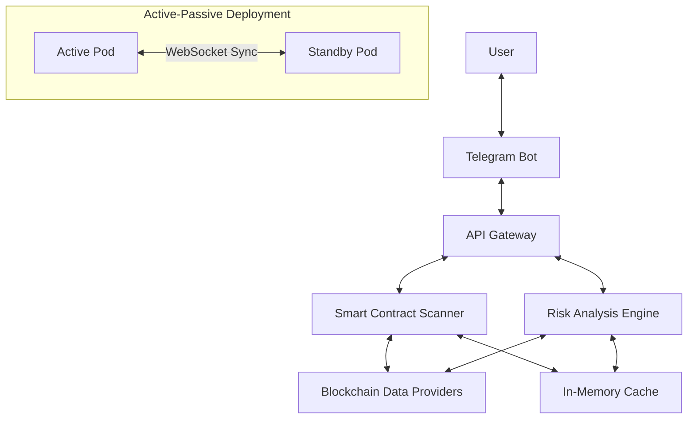
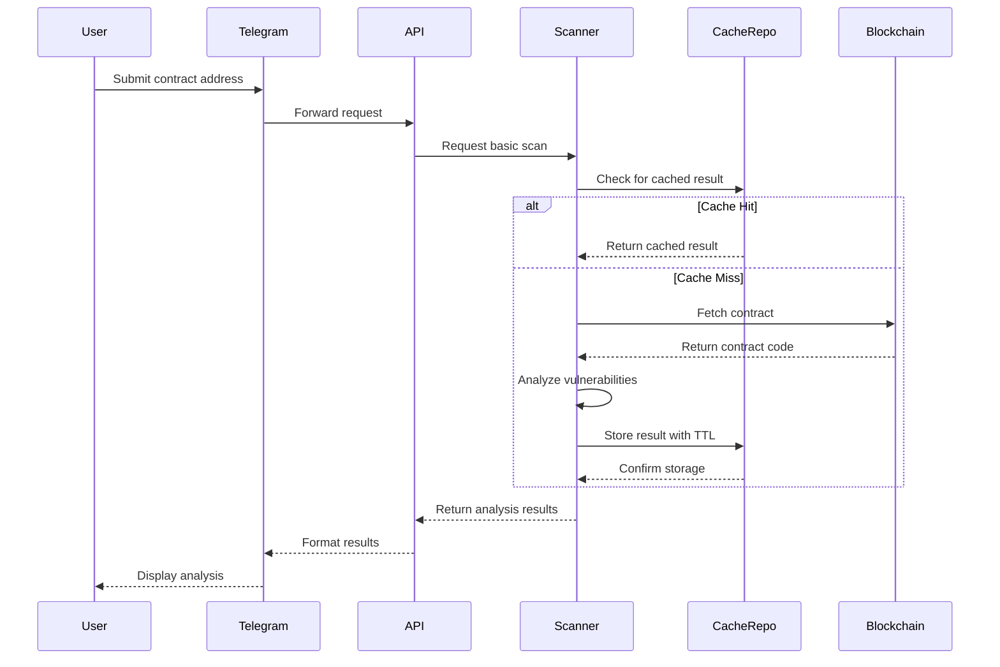
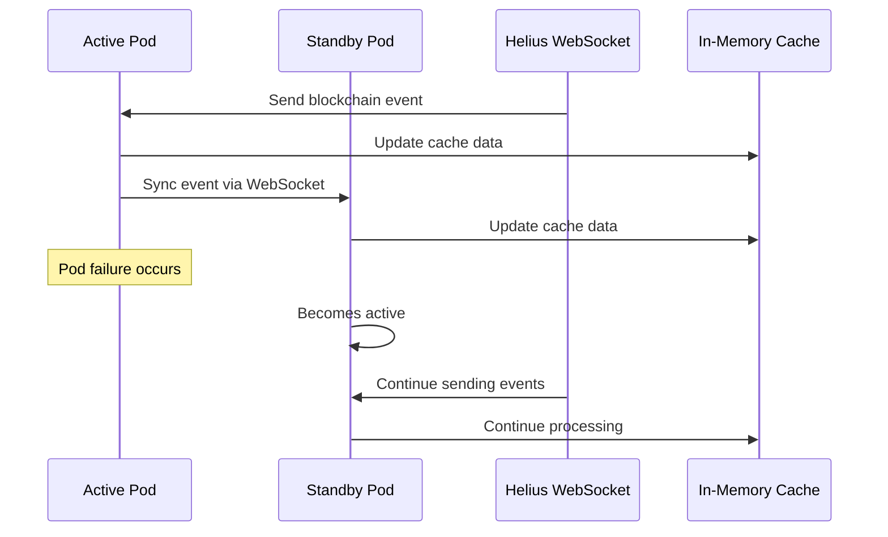

# Blaze Analyst - System Patterns

## System Architecture
Blaze Analyst follows a modular, event-driven architecture with in-memory data storage to ensure scalability and reliability:

## Key Components

### 1. Telegram Bot Interface
- **Pattern**: Command Processor with Menu Navigation
- **Description**: Processes user commands and provides interactive buttons for navigation
- **Responsibilities**:
  - Parse user input
  - Present results in user-friendly format
  - Handle input validation
  - Manage conversation context

### 2. Smart Contract Scanner
- **Pattern**: Pipeline Processing
- **Description**: Processes contracts through a series of specialized analyzers
- **Responsibilities**:
  - Connect to blockchain nodes
  - Fetch and decode contract code
  - Identify security vulnerabilities
  - Generate basic risk scores

### 3. Risk Analysis Engine
- **Pattern**: Aggregator with Statistical Analysis
- **Description**: Combines multiple data sources and applies statistical analysis
- **Responsibilities**:
  - Analyze trading patterns
  - Assess holder distribution
  - Monitor liquidity metrics
  - Apply risk scoring algorithms

### 4. In-Memory Repository
- **Pattern**: Repository Pattern with TTL Cache
- **Description**: Manages data storage in memory with time-to-live and size limits
- **Responsibilities**:
  - Store analysis results with configurable TTL
  - Manage memory limits and enforce bounds
  - Implement LFU eviction for memory management
  - Provide standardized access interface

### 5. High Availability System
- **Pattern**: Active-Passive with WebSocket Synchronization
- **Description**: Ensures system reliability with fast failover between pods
- **Responsibilities**:
  - Maintain active and standby instances
  - Synchronize critical data via WebSocket
  - Enable sub-second failover between instances
  - Repopulate caches after failover

## Communication Patterns

### Request-Response Pattern
- Synchronous communication for immediate analysis
- Real-time processing of user requests
- Structured response format for analysis results

### API-Based Integration
- RESTful APIs for synchronous operations
- GraphQL for complex data queries
- Webhook endpoints for external integrations

### Event-Based Synchronization
- WebSocket connections for real-time data sync
- Event-driven architecture for cache updates
- Subscription-based updates for warm standby

## Data Flow Patterns

### Contract Analysis Flow

### High Availability Flow

## Design Patterns

### Strategy Pattern
- Applied to risk scoring algorithms
- Allows different scoring strategies based on token type
- Facilitates adding new analysis methods

### Factory Pattern
- Used for creating analysis components
- Enables dynamic selection of appropriate analyzers
- Supports extensibility for new token standards

### Adapter Pattern
- Used for blockchain data providers
- Normalizes data from different providers
- Enables seamless provider switching

### Chain of Responsibility
- Implemented for analysis pipeline
- Each analyzer processes specific aspects
- Results are combined for comprehensive analysis

### Repository Pattern
- Applied to in-memory data storage
- Provides standardized interface for data access
- Encapsulates storage implementation details
- Manages TTL and size limits for caches

### Circuit Breaker Pattern
- Used for external service calls
- Prevents cascading failures
- Enables graceful degradation

## Scalability Considerations
- Horizontal scaling of analysis components
- Efficient in-memory caching with TTL and size limits
- Memory bound enforcement with LFU eviction
- Parallel processing of analysis steps
- Optimized blockchain data retrieval
- Active-passive deployment for high availability
- Warm loader for eliminating cold starts 